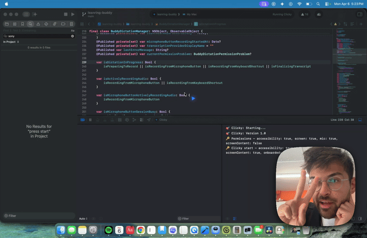

# Hi, this is Clicky.
It's an AI teacher that lives as a buddy next to your cursor. It can see your screen, talk to you, and even point at stuff. Kinda like having a real teacher next to you.

This is a fork of the [original Clicky](https://github.com/farzaa/clicky) with some key changes:
- **No Cloudflare Worker required** — TTS and STT call Smallest AI directly, chat models are configurable per-endpoint
- **Configurable model picker** — supports any Anthropic-compatible API endpoint via a JSON config file
- **Voice mode toggle** — switch between voice and text-only mode
- **Text mode** — press ctrl+option to screenshot and get a streaming text response (no mic needed)
- **Follow-up questions** — within 60 seconds of a response, press ctrl+option again to type a follow-up



## Get started

### Prerequisites

- macOS 14.2+ (for ScreenCaptureKit)
- Xcode 15+
- A [Smallest AI](https://app.smallest.ai/dashboard) API key (for voice mode TTS + STT)
- At least one Anthropic-compatible API endpoint and key for chat (e.g. Anthropic, Alibaba DashScope, Z.AI)

### 1. Clone and open in Xcode

```bash
git clone https://github.com/eSaadster/clicky-prompter.git
cd clicky-prompter
open leanring-buddy.xcodeproj
```

In Xcode:
1. Select the `leanring-buddy` scheme (yes, the typo is intentional, long story)
2. Set your signing team under **Signing & Capabilities**
3. Hit **Cmd + R** to build and run

The app will appear in your menu bar (not the dock). Click the icon to open the panel and grant the permissions it asks for.

### 2. Configure your API keys

On first launch, the app creates config files in `~/Library/Application Support/Clicky/`. Open that directory:

```bash
open ~/Library/Application\ Support/Clicky/
```

**config.json** — Smallest AI API key for voice mode (TTS + STT):

```json
{
  "smallestAIApiKey": "your-smallest-ai-key-here",
  "ttsVoiceId": "emily"
}
```

Get your API key at [app.smallest.ai/dashboard](https://app.smallest.ai/dashboard). Available voices include `emily`, `noah`, `daniel`, `magnus`, and [many more](https://docs.smallest.ai).

**models.json** — Chat model endpoints (supports any Anthropic-compatible API):

```json
[
  {
    "id": "claude-sonnet",
    "displayName": "Sonnet",
    "modelID": "claude-sonnet-4-6",
    "apiEndpoint": "https://api.anthropic.com/v1/messages",
    "apiKey": "your-anthropic-key-here"
  }
]
```

You can add as many models as you want — each can point to a different endpoint. They'll all show up in the model picker dropdown.

### 3. Restart the app

After editing the config files, restart the app (quit from the menu bar panel, then Cmd+R in Xcode). The model picker will show your configured models, and voice mode will use Smallest AI.

## How it works

### Voice mode (default)
Hold **ctrl+option** to talk. Release to send your voice + screenshot to the AI. It responds with text-to-speech audio and can point at things on your screen.

### Text mode
Toggle voice off in the menu bar panel. Press **ctrl+option** to screenshot and get a streaming text response in a bubble near your cursor. Press again within 60 seconds to type a follow-up question.

## Permissions the app needs

- **Accessibility** — for the global keyboard shortcut (ctrl+option)
- **Screen Recording** — for taking screenshots when you use the hotkey
- **Microphone** — for push-to-talk voice capture (only needed in voice mode)

## Architecture

**Menu bar app** (no dock icon) with two `NSPanel` windows — one for the control panel dropdown, one for the full-screen transparent cursor overlay.

- **Chat**: Any Anthropic-compatible model via configurable endpoints in `models.json`
- **TTS**: Smallest AI Lightning v3.1 — direct API call, ~100ms latency
- **STT**: Smallest AI Pulse — upload-based transcription on push-to-talk release
- **Fallback STT**: AssemblyAI (real-time streaming), OpenAI, Apple Speech

Claude can embed `[POINT:x,y:label:screenN]` tags in responses to make the cursor fly to specific UI elements across multiple monitors.

For the full technical breakdown, read `CLAUDE.md`.

## Project structure

```
leanring-buddy/              # Swift source (yes, the typo stays)
  CompanionManager.swift       # Central state machine
  CompanionPanelView.swift     # Menu bar panel UI
  ClaudeAPI.swift              # Claude streaming client
  SmallestAITTSClient.swift    # Text-to-speech (Smallest AI Lightning)
  SmallestAITranscriptionProvider.swift  # Speech-to-text (Smallest AI Pulse)
  OverlayWindow.swift          # Blue cursor overlay
  BuddyDictation*.swift        # Push-to-talk pipeline
  ModelConfiguration.swift     # models.json reader
  ProviderConfiguration.swift  # config.json reader
worker/                      # Cloudflare Worker proxy (legacy, optional)
CLAUDE.md                    # Full architecture doc
```

## Contributing

PRs welcome. If you're using Claude Code, it already knows the codebase — just tell it what you want to build and point it at `CLAUDE.md`.

Originally built by [@farzatv](https://x.com/farzatv). This fork by [@eSaadster](https://github.com/eSaadster).
